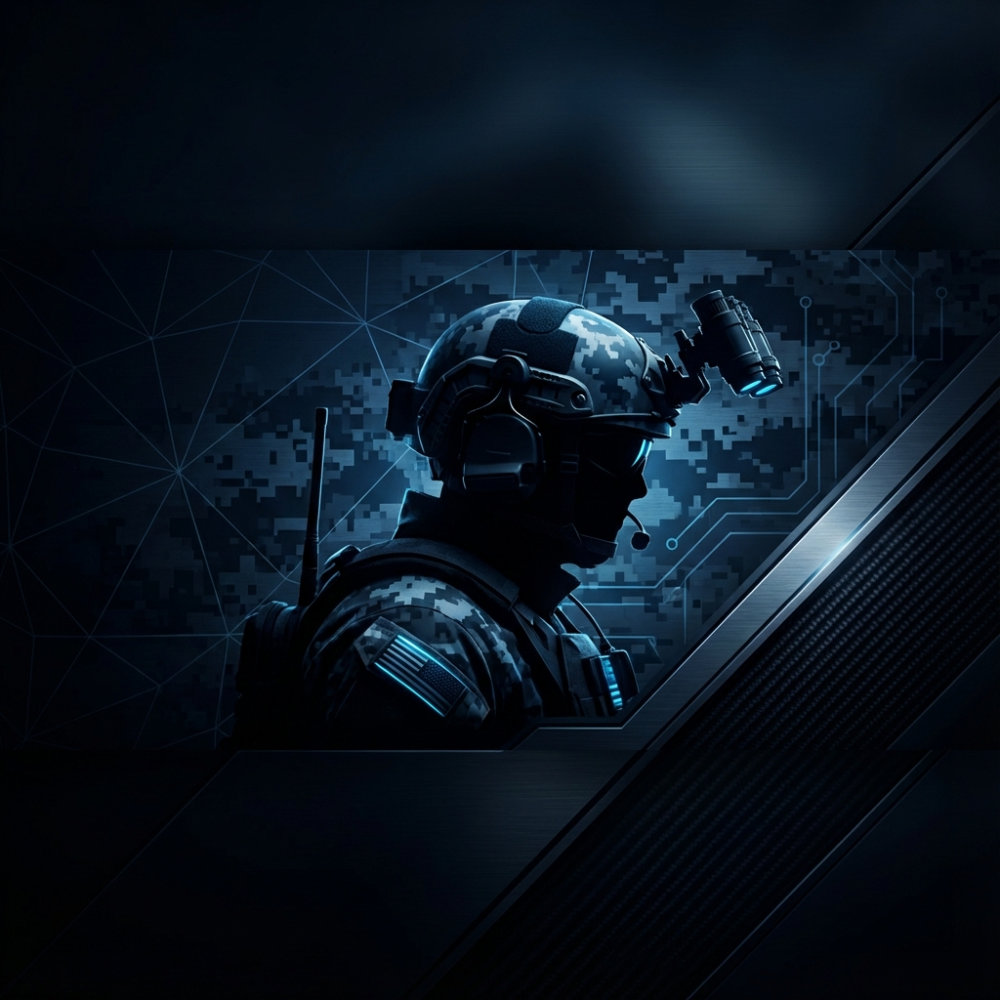

  

  <h1 style="font-size: 2.5rem; font-weight: bold; margin-top: 20px;">
    GUERREIRO DO CONHECIMENTO & DESENVOLVEDOR EM EVOLUÇÃO
  </h1>
  

    "Disciplina é a ponte entre metas e realizações."
  

 

## ⚡ Sobre Mim

Sou o **Gui**, tenho 21 anos e opero em um regime de **alta performance**. Minha vida é pautada por uma rotina militar de estudos e trabalho (24x72h), onde cada hora é estrategicamente alocada para o meu crescimento. Moro no litoral gaúcho e meu foco é absoluto: tornar-me uma máquina de produtividade e conquistar minha vaga na **Polícia Rodoviária Federal**. Sou movido por desafios, seja resolvendo problemas complexos de física e matemática ou otimizando sistemas com código. Minha mentalidade é de um operador tático: **preparação, execução e melhoria contínua.**

 

## 🛠️ Arsenal Tecnológico

  
  
  
  
  
  
  

 

## 🎯 Projetos em Destaque

| Projeto | Classificação | Status |
| :--- | :--- | :--- |
| **🛡️ Operation: Sentinel** | Sistema de monitoramento e produtividade com estética tática. | `Em Desenvolvimento` |
| **⚡ Velocity Calc** | Ferramenta de alta precisão para cálculos físicos e balísticos. | `Planejamento` |
| **🚔 Rota 24/7** | Plataforma de gestão de estudos focada em concursos de elite. | `Conceito` |

 

## 📊 Estatísticas de Combate

  
  

  

 

## ⚔️ Rotina de Evolução

> *"A única maneira de fazer um ótimo trabalho é amar o que você faz."*

Minha semana é uma operação contínua de aprimoramento:

- **📅 Segunda & Sexta:** Aulas teóricas e alinhamento estratégico (Manhã).
- **🛡️ Finais de Semana:** Imersão profunda (Deep Work) no período da tarde.
- **📚 Foco de Elite:** Matemática, Física, Geometria Espacial e Energia Mecânica.
- **🏋️ Treino Tático:** Baterias de questões, correção de falhas e simulação de cenários.
- **🔄 Modo Carreira:** Tratando a vida como um RPG onde o XP é conhecimento real.

 

## 🧠 Filosofia Pessoal

Adoto a postura do **"Guerreiro Silencioso"**. Não falo sobre o que vou fazer; eu faço. Meu objetivo é melhorar **1% todos os dias**, sem falhas. A disciplina não é uma escolha, é meu sistema operacional. Seja estudando atrito cinético ou debugando código, a missão é sempre a mesma: **Excelência.**

 

## 📡 Canal de Comunicação

  
  

 

  

